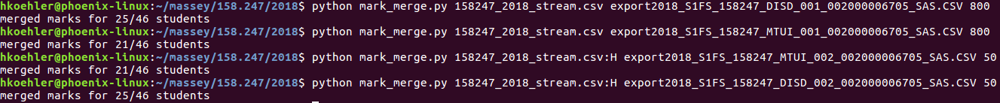

# About
Script to help lecturers transfer marks from Stream to SMS at Massey University, by copying and scaling marks from the Stream export file into the SMS input file.
This is only needed when transferring marks manually, e.g. because automatic transfer wasn't set up or doesn't work correctly.

Requires Python to be installed (Python 2 and 3 should both work).

# Usage
1. Export marks from stream (as CSV), exporting the totals you want to import into SMS (one column per assessment item in SMS).
2. Log into SMS and export marks (this will give you some blank CSV templates). There will be one file per assessment item and offering (internal/extramural). The content may be identical for different assessments, but the filename is used to determine the assessment item.
3. Run the script for each of the export files. Call syntax (`python` may need to be replaced with `python2` or `python3` on some systems) is

    `python mark_merge.py <stream.csv>[:<column>] <sms.csv> <max_marks>`

    Here `<column>` indicates the column of the stream export CSV file containing the marks to be used as input - if omitted it defaults to column G.
    Parameter `<max_marks>` denotes the total number of marks available, which is needed for percentage scaling. E.g. a value of 8 will be scaled to 80% if `<max_marks>` is 10, or to 40% if `<max_marks>` is 20.

4. Import the `<sms.csv>` file into SMS. There will likely be some error messages about students that have withdrawn already having been processed, which can be ignored.

## Example

In the example below I was using 2 Stream export files for two separate assessments, each of which includes both internal and extramural cohorts. For the first assessment the desired results were located in column G (the default), for the second in column H.
These are copied over into 4 different SMS import files, one per assessment and cohort.

